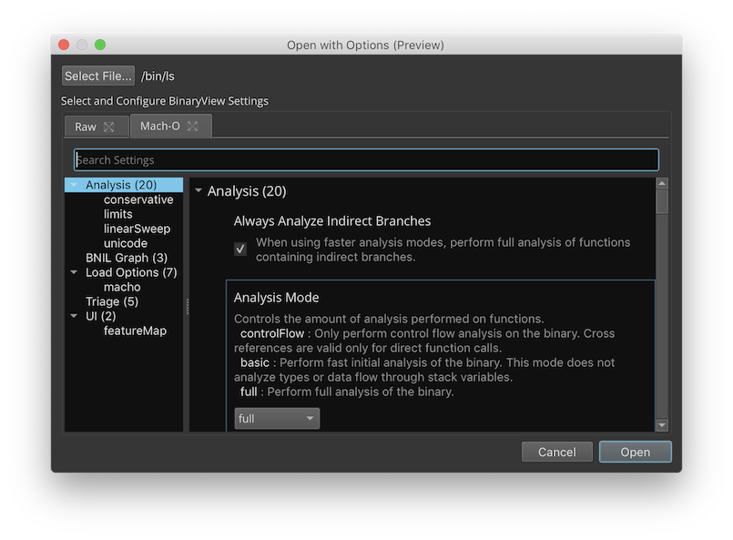
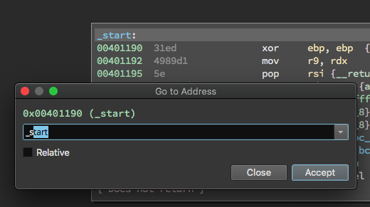
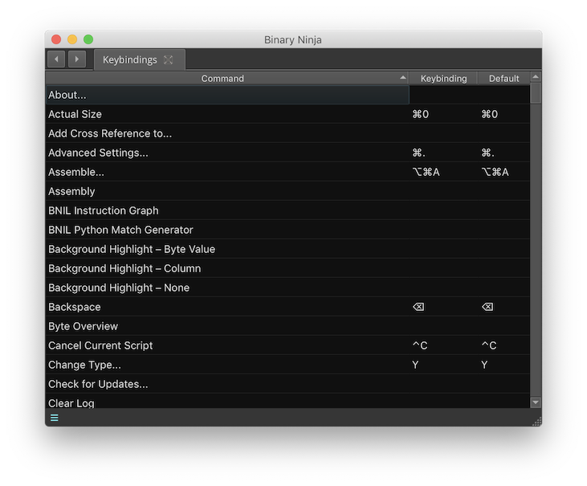
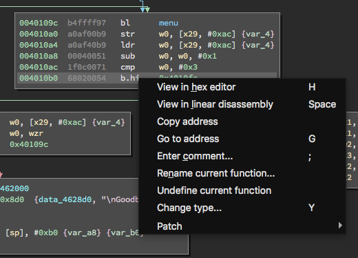
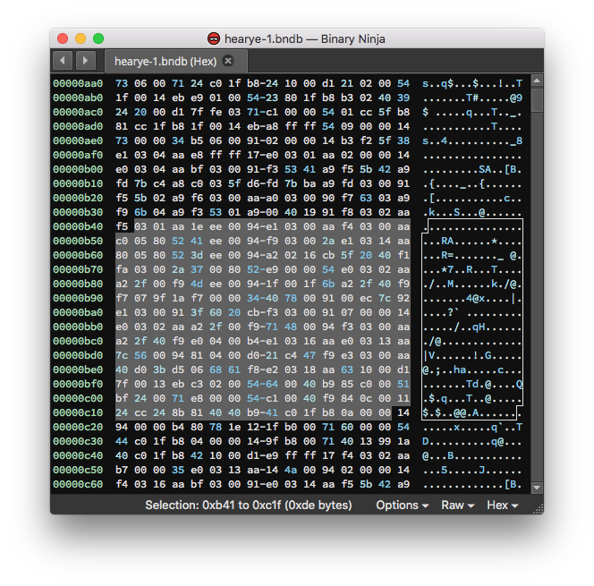
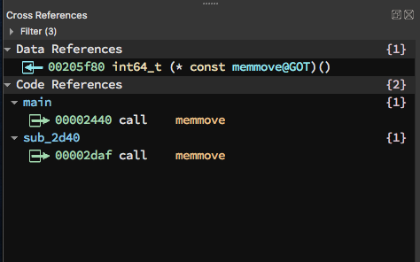
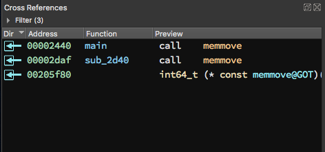
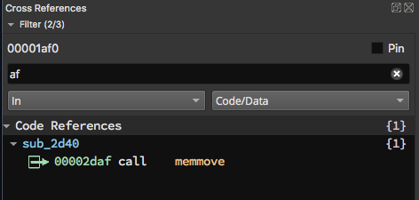
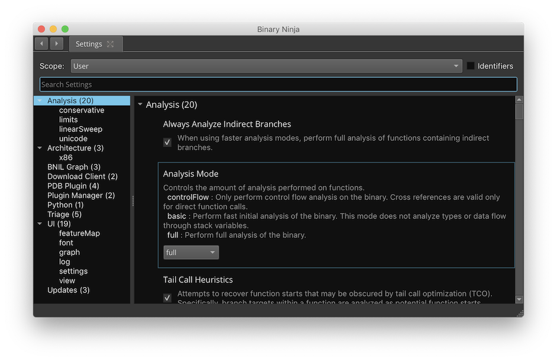

# Getting Started

Welcome to Binary Ninja. This introduction document is meant to quickly guide you over some of the most common uses of Binary Ninja.

## Directories

Binary Ninja uses two main locations. The first is the install path of the binary itself and the second is the user folders for user-installed content.

### Binary Path

Binaries are installed in the following locations by default:

- MacOS: `/Applications/Binary Ninja.app`
- Windows (global install): `C:\Program Files\Vector35\BinaryNinja`
- Windows (user install): `%LOCALAPPDATA%\Vector35\BinaryNinja`
- Linux: Wherever you extract it! (No standard location)

!!! Warning "Warning"
    Do not put any user content in the install-path of Binary Ninja. The auto-update process of Binary Ninja may replace any files included in these folders.

### User Folder

The base locations of user folders are:

- MacOS: `~/Library/Application Support/Binary Ninja`
- Linux: `~/.binaryninja`
- Windows: `%APPDATA%\Binary Ninja`

Contents of the user folder includes:

- `lastrun`: A text file containing the directory of the last BinaryNinja binary path -- very useful for plugins to resolve the install locations in non-default settings or on Linux.
- `license.dat`: License file
- `plugins/`: Folder containing all manually installed user plugins
- `repositories/`: Folder containing files and plugins managed by the [Plugin Manager API](https://api.binary.ninja/binaryninja.pluginmanager-module.html)
- `settings.json`: User settings file (see [settings](#settings))
- `keybindings.json`: Custom key bindings (see [key bindings](#custom-keybindings))

## License

When you first run Binary Ninja, it will prompt you for your license key. You should have received your license key via email after your purchase. If not, please contact [support](https://binary.ninja/support).

Once the license key is installed, you can change it, back it up, or otherwise inspect it simply by looking inside the base of the user folder for `license.dat`.

## Linux Setup

Because Linux install locations can vary widely, we do not assume a Binary Ninja has been installed in any particular folder on Linux. Rather, you can simply run `binaryninja/scripts/linux-setup.sh` after extracting the zip and various file associations, icons, and other settings will be set up. Run it with `-h` to see the customization options.

## Loading Files

You can load files in many ways:

1. Drag-and-drop a file onto the Binary Ninja window
2. Use the `File/Open` menu or `Open` button on the start screen (`[CMD/CTRL] o`)
3. Use the `File/Open with Options` menu which allows you to customize the analysis options (`[CMD/CTRL-SHIFT] o`)
4. Open a file from the Triage picker (`File/Open for Triage`) which enables several minimal analysis options and shows a summary view first
5. Click an item in the recent files list (hold `[CMD/CTRL-SHIFT]` while clicking to use the `Open with Options` workflow)
6. Run Binary Ninja with an optional command-line parameter
7. Open a file from a URL via the `[CMD/CTRL] l` hot key
8. Open a file using the `binaryninja:` URL handler. For security reasons, the URL handler requires you to confirm a warning before opening a file via the URL handler. URLs additionally support deep linking using the `expr` query parameter where expression value is a valid parsable expression such as those possible in the [navigation dialog](#navigating), and fully documented in the [`parse_expression`](https://api.binary.ninja/binaryninja.binaryview-module.html?highlight=parse_expression#binaryninja.binaryview.BinaryView.parse_expression) API. Below a few examples are provided:
    * URLs For referencing files on the local file system.
        * `binaryninja:///bin/ls?expr=sub_2830` - open the given file and navigate to the function: `sub_2830`
        * `binaryninja:///bin/ls?expr=.text` - open the given file and navigate to the start address of the `.text` section
        * `binaryninja:///bin/ls?expr=.text+6b` - open the given file and navigate to the hexadecimal offset `6b` from the `.text` section.
    * URLs For referencing remote file files either the url should be prefixed with `binaryninja:` and optionally suffixed with the `expr` query parameter
        * `binaryninja:file://<remote_path>?expr=[.data + 400]` - Download the remote file and navigate to the address at `.data` plus `0x400`

## Analysis

As soon as you open a file, Binary Ninja begins its auto-analysis which is fairly similar to decompiling the entire binary.

Even while Binary Ninja is analyzing a binary, the UI should be responsive. Not only that, but because the analysis prioritizes user-requested analysis, you can start navigating a binary immediately and wherever you are viewing will be prioritized for analysis. The current progress through a binary is shown in the status bar (more details are available via `bv.analysis_info` in the Python console), but note that the total number of items left to analyze will go up as well as the binary is processed and more items are discovered that require analysis.

Errors or warnings during the load of the binary are also shown in the status bar, along with an icon (in the case of the image above, a large number of warnings were shown). The most common warnings are from incomplete lifting and can be safely ignored. If the warnings include a message like `Data flow for function at 0x41414141 did not terminate`, then please report the binary to the [bug database](https://github.com/Vector35/binaryninja-api/issues).

### Analysis Speed

If you wish to speed up analysis, you have several options. The first is to use the `File/Open for Triage` menu which activates the Triage file picker. By default, [Triage mode](https://binary.ninja/2019/04/01/hackathon-2019-summary.html#triage-mode-rusty) will enable a faster set of default analysis options that doesn't provide as much in-depth analysis but is significantly faster.

Additionally, using the [open with options](#loading-files) feature allows for customization of a number of analysis options on a per-binary basis. See [all settings](#all-settings) under the `analysis` category for more details.

## Interacting

### Navigating

Navigating code in Binary Ninja is usually a case of just double-clicking where you want to go. Addresses, references, functions, jump edges, etc, can all be double-clicked to navigate. Additionally, The `g` hot key can navigate to a specific address in the current view. Syntax for this field is very flexible. Full expressions can be entered including basic arithmetic, dereferencing, and name resolution (function names, data variable names, segment names, etc). Numerics default to hexadecimal but that can be controlled as well. Full documentation on the syntax of this field can be found [here](https://api.binary.ninja/binaryninja.binaryview-module.html?highlight=parse_expression#binaryninja.binaryview.BinaryView.parse_expression).

### Switching Views

Switching views happens multiple ways. In some instances, it is automatic (clicking a data reference from graph view will navigate to linear view as data is not shown in the graph view), and there are multiple ways to manually change views as well. While navigating, you can use the view hot keys (see below) to switch to a specific view at the same location as the current selection. Alternatively, the view menu in the bottom-right can be used to change views without navigating to any given location.

### Command-Palette

One great feature for quickly navigating through a variety of options and actions is the `command palette`. Inspired by similar features in [Sublime](http://docs.sublimetext.info/en/latest/reference/command_palette.html), and [VS Code](https://code.visualstudio.com/docs/getstarted/userinterface#_command-palette), the command-palette is a front end into an application-wide, context-sensitive action system that all actions, plugins, and hotkeys in the system are routed through.

To trigger it, simply use the `[CMD/CTRL] p` hot key. Note that the command-palette is context-sensitive and therefore some actions (for example, `Display as - Binary`) may only be available depending on your current view or selection. This is also available to plugins. For example, a plugin may use [PluginCommand.register](https://api.binary.ninja/binaryninja.plugin-module.html#binaryninja.plugin.PluginCommand.register) with the optional `is_valid` callback to determine when the action should be available.

### Custom Hotkeys

Any action in the [action system](#command-palette) can have a custom hot key mapped to it. To access the keybindings menu, use the `[CMD/CTRL-SHIFT] b` hot key, via the `Edit / Keybindings...` menu, or the `Keybindings` [command palette](#command-palette) entry.

Note
!!! Tip "Note"
    On MacOS, `Ctrl` refers to the Command key, while `Meta` refers to the Control key. This is a remapping performed by Qt to make cross-platform keybindings easier to define.

!!! Tip "Tip"
    To search in the keybindings list, just click to make sure it's focused and start typing!

### Default Hotkeys

 - `h` : Switch to hex view
 - `p` : Create a function
 - `[ESC]` : Navigate backward
 - `[CMD] [` (MacOS) : Navigate backward
 - `[CMD] ]` (MacOS) : Navigate forward
 - `[CTRL] [` (Windows/Linux) : Navigate backward
 - `[CTRL] ]` (Windows/Linux) : Navigate forward
 - `[SPACE]` : Toggle between linear view and graph view
 - `g` : Go To Address dialog
 - `n` : Name a symbol
 - `u` : Undefine an existing symbol (only for removing new user-defined names)
 - `e` : Edits an instruction (by modifying the original binary -- currently only enabled for x86, and x64)
 - `x` : Focuses the cross-reference pane
 - `;` : Adds a comment
 - `i` : Cycles between disassembly, LLIL, MLIL and HLIL in graph view
 - `t` : Switch to type view
 - `y` : Change type
 - `a` : Change the data type to an ASCII string
 - [1248] : Change type directly to a data variable of the indicated widths
 - `d` : Switches between data variables of various widths
 - `r` : Change the data type to single ASCII character
 - `o` : Create a pointer data type
 - `[CMD-SHIFT] +` (MacOS) : Graph view zoom in
 - `[CMD-SHIFT] -` (MacOS) : Graph view zoom out
 - `[CTRL-SHIFT] +` (Windows/Linux) : Graph view zoom in
 - `[CTRL-SHIFT] -` (Windows/Linux) : Graph view zoom out

### Graph View

The default view in Binary Ninja when opening a binary is a graph view that groups the basic blocks of disassembly into visually distinct blocks with edges showing control flow between them.

Features of the graph view include:

- Ability to double click edges to quickly jump between locations
- Zoom (CTRL-mouse wheel)
- Vertical Scrolling (Side scroll bar as well as mouse wheel)
- Horizontal Scrolling (Bottom scroll bar as well as SHIFT-mouse wheel)
- Individual highlighting of arguments, addresses, immediate values
- Edge colors indicate whether the path is the true or false case of a conditional jump (a color-blind option in the preferences is useful for those with red-green color blindness)
- Context menu that can trigger some function-wide actions as well as some specific to the highlighted instruction (such as inverting branch logic or replacing a specific function with a NOP)

### View Options

Each of the views (Hex, Graph, Linear) have a variety of options configurable in the bottom-right of the UI.

Current options include:

- Hex
    - Background highlight
        - None
        - Column
        - Byte value
    - Color highlight
        - None
        - ASCII and printable
        - Modification
    - Contrast
        - Normal
        - Medium
        - Highlight
- Graph
    - Show address
    - Show opcode bytes
    - Assembly
    - Lifted IL
        - Show IL flag usage (if showing Lifted IL)
    - Low Level IL
        - Show basic block register state (if showing Low Level IL)
    - Medium Level IL
        - Show basic block register state (if showing Medium IL)
    - High Level IL
        - Show basic block register state (if showing High IL)
- Linear
    - Show address
    - Show call parameter names
    - Show opcode bytes
    - Show register set highlighting
    - Show variable types
        - List default register types

### Hex View

The hexadecimal view is useful for view raw binary files that may or may not even be executable binaries. The hex view is particularly good for transforming data in various ways via the `Copy as`, `Transform`, and `Paste from` menus. Note that `Transform` menu options will transform the data in-place, and that these options will only work when the Hex View is in the `Raw` mode as opposed to any of the binary views (such as "ELF", "Mach-O", or "PE").

!!! Tip "Tip"
    Any changes made in the Hex view will take effect immediately in any other views open into the same file (new views can be created via the `Split to new tab`, or `Split to new window` options under `View`.). This can, however, cause large amounts of re-analysis so be warned before making large edits or transformations in a large binary file.

### Cross References Pane

The Cross References view in the lower-left shows all cross-references to the currently selected address or address range. Additionally this pane will change depending on whether an entire line is selected (all cross-references to that address are shown), or whether a specific token within the line is selected. For instance if you click on the symbol `memmove` in `call memmove` it will display all known cross-references to `memmove`, whereas if you click on the line the `call` instruction is on, you will only get cross-references to the address of the call instruction. Cross-references can be either incoming or outgoing, and they can be either data or code. To be explicit:

* Incoming-Data References - The reference is a data variable pointing to this location.
* Incoming-Code References - The reference is a pointer in code pointing to this location.
* Outgoing-Data References - The currently selected item is a data variable pointer to the reference which itself is either data or code.
* Outgoing-Code References - The currently selected item is code pointing to the reference which itself is either data or code.

#### Tree-based Layout
The cross-references pane comes in two different layouts: tree-based (default and shown above) and table-based (this can be toggled through the context menu or the command palette). The tree-based layout provides the most condensed view, allowing users to quickly see (for instance) how many references are present to the current selection overall and by function. It also allows collapsing to quickly hide uninteresting results.

#### Table-based Layout

The table-based layout provides field-based sorting and multi-select. Clicking the `Filter` text expands the filter pane, showing options for filtering the current results.

#### Cross-Reference Filtering

The first of the two drop down boxes allows the selection of incoming, outgoing, or both incoming and outgoing (default). The second allows selection of code, data, or code and data (default). The text box allows regular expression matching of results. When a filter is selected the `Filter` display changes from `Filter (<total-count>)` to `Filter (<total-filtered>/<total-count>)`

#### Cross-Reference Pinning

By default Binary Ninja's cross-reference pane is dynamic, allowing quick navigation to relevant references. Sometimes you might rather have the current references stick around so they can be used as a sort of work-list. This workflow is supported in three different ways. First and most obviously by clicking the `Pin` checkbox (which is only visible if the `Filter` drop-down is open). This prevents the list of cross-references from being updated even after the current selection is changed. Alternatively, `SHIFT+X` (or selecting `Focus Pinned Cross References` in the context menu or command palette) pops up a `Pinned Cross References` pane. This pane has a static address range which can only be updated through the `Pinned Cross References` action. The third way would be to select (or multi-select in table view) a set of cross-references then right-click `Tag Selected Rows`. The tag pane can then be used to navigate those references. Tags allow for persistent lists to be saved to analysis database whereas the other options only last for the current session.

#### Cross-Reference Hotkeys

* `x` - Focus the cross-references pane
* `[SHIFT] x` Focus the pinned cross-references pane
* `[OPTION/ALT] x` - Navigate to the next cross-reference
* `[OPTION/ALT-SHIFT] x` - Navigate to the previous cross-reference

The following are only available when the cross-references pane is in focus:

* `[CMD/CTRL] f` - Open the filter dialog
* `[ESC]` - Clear the search dialog
* `[CMD/CTRL] a` - Select all cross-references
* `[ARROW UP/DOWN]` - Select (but don't navigate) next/previous cross-reference
* `[ENTER]` - Navigate to the selected reference

### Linear View

Linear view is a hybrid view between a graph-based disassembly window and the raw hex view. It lists the entire binary's memory in a linear fashion and is especially useful when trying to find sections of a binary that were not properly identified as code or even just examining data.

Linear view is most commonly used for identifying and adding type information for unknown data. To this end, as you scroll, you'll see data and code interspersed. Much like the graph view, you can turn on and off addresses via the command palette `Show Address` or the `Options` menu in the lower right. Many other [option](#view-options) are also available.

### Function List

The function list in Binary Ninja shows the list of functions currently identified. As large binaries are analyzed, the list may grow during analysis. The function list starts with known functions such as the entry point, exports, or using other features of the binary file format and explores from there to identify other functions.

The function list also highlights imports, and functions identified with symbols in different colors to make them easier to identify.

!!! Tip "Tip"
    To search in the function list, just click to make sure it's focused and start typing!

### Script (Python) Console

The integrated script console is useful for small scripts that aren't worth writing as full plugins.

To trigger the console, either use `<CTRL>-<BACKTICK>`, or use the `View`/`Script console` menu.

Once loaded, the script console can be docked in different locations or popped out into a stand-alone window. Note that [at this time](https://github.com/Vector35/binaryninja-api/issues/226) window locations are not saved on restart.

Multi-line input is possible just by doing what you'd normally do in python. If you leave a trailing `:` at the end of a line, the box will automatically turn into a multi-line edit box, complete with a command-history. To submit that multi-line input, use `<CTRL>-<ENTER>`

By default the interactive python prompt has a number of convenient helper functions and variables built in:

- `here` / `current_address`: address of the current selection
- `bv` / `current_view` / : the current [BinaryView](https://api.binary.ninja/binaryninja.BinaryView.html)
- `current_function`: the current [Function](https://api.binary.ninja/binaryninja.Function.html)
- `current_basic_block`: the current [BasicBlock](https://api.binary.ninja/binaryninja.BasicBlock.html)
- `current_llil`: the current [LowLevelILFunction](https://api.binary.ninja/binaryninja.lowlevelil.LowLevelILFunction.html)
- `current_mlil`: the current [MediumLevelILFunction](https://api.binary.ninja/binaryninja.mediumlevelil.MediumLevelILFunction.html)
- `current_selection`: a tuple of the start and end addresses of the current selection
- `write_at_cursor(data)`: function that writes data to the start of the current selection
- `get_selected_data()`: function that returns the data in the current selection

Note
!!! Tip "Note"
    The current script console only supports Python at the moment, but it's fully extensible for other programming languages for advanced users who wish to implement their own bindings.

## Using Plugins

Plugins can be installed by one of two methods. First, they can be manually installed by adding the plugin (either a `.py` file or a folder implementing a python module with a `__init__.py` file) to the appropriate path:

- MacOS: `~/Library/Application Support/Binary Ninja/plugins/`
- Linux: `~/.binaryninja/plugins/`
- Windows: `%APPDATA%\Binary Ninja\plugins`

Alternatively, plugins can be installed with the new [pluginmanager](https://api.binary.ninja/binaryninja.pluginmanager-module.html) API.

For more detailed information on plugins, see the [plugin guide](/guide/plugins).

## PDB Plugin

Binary Ninja supports loading PDB files through a built in PDB loader. When selected from the plugin menu it attempts to find the corresponding PDB file using the following search order:

1. Look for in the same directory as the opened file/bndb (e.g. If you have `c:\foo.exe` or `c:\foo.bndb` open the PDB plugin looks for `c:\foo.pdb`)
2. Look in the local symbol store. This is the directory specified by the settings: `local-store-relative` or `local-store-absolute`. The format of this directory is `foo.pdb\<guid>\foo.pdb`.
3. Attempt to connect and download the PDB from the list of symbol servers specified in setting `symbol-server-list`.
4. Prompt the user for the PDB.

## Settings

Settings are available via the `[CMD/CTRL] ,` hot key and allow a wide variety of customization.

All settings are saved in the [_user_ directory](#user-folder) in the file `settings.json`. Each top level object in this file is represents a different plugin or logical group.  

Enabling the `identifiers` check box will show the raw identifiers used to set settings in the json file which may be useful for [programmatically](https://api.binary.ninja/binaryninja.settings-module.html) interacting with settings.

Note
!!! Tip "Note"
    Changing a setting to a non-default value and then changing it back to a default value will result in explicitly specifying that default value which will not change if the default ever does. This can be avoided by right-clicking and choosing `Clear Setting` which will remove the user-setting.

### All Settings

Here's a list of all settings currently available from the UI:

|Category|Setting|Description|Type|Default|Key|
|---|---|---|---|---|---|
|analysis|Disallow Branch to String|Enable the ability to halt analysis of branch targets that fall within a string reference. This setting may be useful for malformed binaries.|`boolean`|`False`|<a id='analysis.conservative.disallowBranchToString'>analysis.conservative.disallowBranchToString</a>|
|analysis|Alternate Type Propagation|Enable an alternate approach for function type propagation. This setting is experimental and may be useful for some binaries.|`boolean`|`False`|<a id='analysis.experimental.alternateTypePropagation'>analysis.experimental.alternateTypePropagation</a>|
|analysis|Always Analyze Indirect Branches|When using faster analysis modes, perform full analysis of functions containing indirect branches.|`boolean`|`True`|<a id='analysis.forceIndirectBranches'>analysis.forceIndirectBranches</a>|
|analysis|Advanced Analysis Cache Size|Controls the number of functions for which the most recent generated advanced analysis is cached. Large values are may result in very high memory utilization.|`number`|`64`|<a id='analysis.limits.cacheSize'>analysis.limits.cacheSize</a>|
|analysis|Max Function Analysis Time|Any functions that exceed this analysis time are deferred. A value of 0 disables this feature. The default value is 20 seconds. Time is specified in milliseconds.|`number`|`20000`|<a id='analysis.limits.maxFunctionAnalysisTime'>analysis.limits.maxFunctionAnalysisTime</a>|
|analysis|Max Function Size|Any functions over this size will not be automatically analyzed. A value of 0 disables analysis of functions and suppresses the related log warning. To override see FunctionAnalysisSkipOverride. Size is specified in bytes.|`number`|`65536`|<a id='analysis.limits.maxFunctionSize'>analysis.limits.maxFunctionSize</a>|
|analysis|Max Function Update Count|Any functions that exceed this incremental update count are deferred. A value of 0 disables this feature.|`number`|`100`|<a id='analysis.limits.maxFunctionUpdateCount'>analysis.limits.maxFunctionUpdateCount</a>|
|analysis|Max Lookup Table Size|Limits the maximum number of entries for a lookup table.|`number`|`4095`|<a id='analysis.limits.maxLookupTableSize'>analysis.limits.maxLookupTableSize</a>|
|analysis|Minimum String Length|The minimum length for strings created during auto-analysis|`number`|`4`|<a id='analysis.limits.minStringLength'>analysis.limits.minStringLength</a>|
|analysis|Worker Thread Count|The number of worker threads available for concurrent analysis activities.|`number`|`11`|<a id='analysis.limits.workerThreadCount'>analysis.limits.workerThreadCount</a>|
|analysis|Autorun Linear Sweep|Automatically run linear sweep when opening a binary for analysis.|`boolean`|`True`|<a id='analysis.linearSweep.autorun'>analysis.linearSweep.autorun</a>|
|analysis|Control Flow Graph Analysis|Enable the control flow graph analysis (Analysis Phase 3) portion of linear sweep.|`boolean`|`True`|<a id='analysis.linearSweep.controlFlowGraph'>analysis.linearSweep.controlFlowGraph</a>|
|analysis|Detailed Linear Sweep Log Information|Linear sweep generates additional log information at the InfoLog level.|`boolean`|`False`|<a id='analysis.linearSweep.detailedLogInfo'>analysis.linearSweep.detailedLogInfo</a>|
|analysis|Entropy Heuristics for Linear Sweep|Enable the application of entropy based heuristics to the function search space for linear sweep.|`boolean`|`True`|<a id='analysis.linearSweep.entropyHeuristics'>analysis.linearSweep.entropyHeuristics</a>|
|analysis|Max Linear Sweep Work Queues|The number of binary regions under concurrent analysis.|`number`|`64`|<a id='analysis.linearSweep.maxWorkQueues'>analysis.linearSweep.maxWorkQueues</a>|
|analysis|Analysis Mode|Controls the amount of analysis performed on functions.|`string`|`full`|<a id='analysis.mode'>analysis.mode</a>|
| | |  enum: Only perform control flow analysis on the binary. Cross references are valid only for direct function calls. [Disassembly Only]|`enum`|`controlFlow`|<a id='analysis.mode'>analysis.mode</a>|
| | |  enum: Perform fast initial analysis of the binary. This mode does not analyze types or data flow through stack variables. [LLIL and Equivalents]|`enum`|`basic`|<a id='analysis.mode'>analysis.mode</a>|
| | |  enum: Perform analysis which includes type propagation and data flow. [MLIL and Equivalents]|`enum`|`intermediate`|<a id='analysis.mode'>analysis.mode</a>|
| | |  enum: Perform full analysis of the binary.|`enum`|`full`|<a id='analysis.mode'>analysis.mode</a>|
|analysis|Never Save Undo Data|Never save previous user actions to the database.|`boolean`|`False`|<a id='analysis.neverSaveUndoData'>analysis.neverSaveUndoData</a>|
|analysis|Autorun Function Signature Matcher|Automatically run the function signature matcher when opening a binary for analysis.|`boolean`|`True`|<a id='analysis.signatureMatcher.autorun'>analysis.signatureMatcher.autorun</a>|
|analysis|Auto Function Analysis Suppression|Enable suppressing analysis of automatically discovered functions.|`boolean`|`False`|<a id='analysis.suppressNewAutoFunctionAnalysis'>analysis.suppressNewAutoFunctionAnalysis</a>|
|analysis|Tail Call Heuristics|Attempts to recover function starts that may be obscured by tail call optimization (TCO). Specifically, branch targets within a function are analyzed as potential function starts.|`boolean`|`True`|<a id='analysis.tailCallHeuristics'>analysis.tailCallHeuristics</a>|
|analysis|Tail Call Translation|Performs tail call translation for jump instructions where the target is an existing function start.|`boolean`|`True`|<a id='analysis.tailCallTranslation'>analysis.tailCallTranslation</a>|
|analysis|Unicode Blocks|Defines which unicode blocks to consider when searching for strings.|`array`|`[]`|<a id='analysis.unicode.blocks'>analysis.unicode.blocks</a>|
|analysis|UTF-16 Encoding|Whether or not to consider UTF-16 code points when searching for strings.|`boolean`|`True`|<a id='analysis.unicode.utf16'>analysis.unicode.utf16</a>|
|analysis|UTF-32 Encoding|Whether or not to consider UTF-32 code points when searching for strings.|`boolean`|`True`|<a id='analysis.unicode.utf32'>analysis.unicode.utf32</a>|
|analysis|UTF-8 Encoding|Whether or not to consider UTF-8 code points when searching for strings.|`boolean`|`True`|<a id='analysis.unicode.utf8'>analysis.unicode.utf8</a>|
|arch|x86 Disassembly Case|Specify the case for opcodes, operands, and registers.|`boolean`|`True`|<a id='arch.x86.disassembly.lowercase'>arch.x86.disassembly.lowercase</a>|
|arch|x86 Disassembly Separator|Specify the token separator between operands.|`string`|`, `|<a id='arch.x86.disassembly.separator'>arch.x86.disassembly.separator</a>|
|arch|x86 Disassembly Syntax|Specify disassembly syntax for the x86/x86_64 architectures.|`string`|`BN_INTEL`|<a id='arch.x86.disassembly.syntax'>arch.x86.disassembly.syntax</a>|
| | |  enum: Sets the disassembly syntax to a simplified Intel format. (TBD) |`enum`|`BN_INTEL`|<a id='arch.x86.disassembly.syntax'>arch.x86.disassembly.syntax</a>|
| | |  enum: Sets the disassembly syntax to Intel format. (Destination on the left) |`enum`|`INTEL`|<a id='arch.x86.disassembly.syntax'>arch.x86.disassembly.syntax</a>|
| | |  enum: Sets the disassembly syntax to AT&T format. (Destination on the right) |`enum`|`AT&T`|<a id='arch.x86.disassembly.syntax'>arch.x86.disassembly.syntax</a>|
|downloadClient|HTTPS Proxy|Override default HTTPS proxy settings. By default, HTTPS Proxy settings are detected and used automatically via environment variables (e.g., https_proxy). Alternatively, proxy settings are obtained from the Internet Settings section of the Windows registry, or the Mac OS X System Configuration Framework.|`string`||<a id='downloadClient.httpsProxy'>downloadClient.httpsProxy</a>|
|downloadClient|Download Provider|Specify the registered DownloadProvider which enables resource fetching over HTTPS.|`string`|`PythonDownloadProvider`|<a id='downloadClient.providerName'>downloadClient.providerName</a>|
| | | |`enum`|`QtDownloadProvider`|<a id='downloadClient.providerName'>downloadClient.providerName</a>|
| | | |`enum`|`PythonDownloadProvider`|<a id='downloadClient.providerName'>downloadClient.providerName</a>|
|pdb|Auto Download PDBs|Automatically download pdb files from specified symbol servers.|`boolean`|`True`|<a id='pdb.autoDownload'>pdb.autoDownload</a>|
|pdb|Absolute PDB Symbol Store Path|Absolute path specifying where the PDB symbol store exists on this machine, overrides relative path.|`string`||<a id='pdb.localStoreAbsolute'>pdb.localStoreAbsolute</a>|
|pdb|Relative PDB Symbol Store Path|Path *relative* to the binaryninja _user_ directory, specifying the pdb symbol store.|`string`|`symbols`|<a id='pdb.localStoreRelative'>pdb.localStoreRelative</a>|
|pdb|Symbol Server List|List of servers to query for pdb symbols.|`array`|`['https://msdl.microsoft.com/download/symbols']`|<a id='pdb.symbolServerList'>pdb.symbolServerList</a>|
|pluginManager|Community Plugin Manager Update Channel|Specify which community update channel the Plugin Manager should update plugins from.|`string`|`master`|<a id='pluginManager.communityUpdateChannel'>pluginManager.communityUpdateChannel</a>|
| | |  enum: The default channel. This setting should be used unless you are testing the Plugin Manager.|`enum`|`master`|<a id='pluginManager.communityUpdateChannel'>pluginManager.communityUpdateChannel</a>|
| | |  enum: Plugin Manager test channel.|`enum`|`test`|<a id='pluginManager.communityUpdateChannel'>pluginManager.communityUpdateChannel</a>|
|pluginManager|Official Plugin Manager Update Channel|Specify which official update channel the Plugin Manager should update plugins from.|`string`|`master`|<a id='pluginManager.officialUpdateChannel'>pluginManager.officialUpdateChannel</a>|
| | |  enum: The default channel. This setting should be used unless you are testing the Plugin Manager.|`enum`|`master`|<a id='pluginManager.officialUpdateChannel'>pluginManager.officialUpdateChannel</a>|
| | |  enum: Plugin Manager test channel.|`enum`|`test`|<a id='pluginManager.officialUpdateChannel'>pluginManager.officialUpdateChannel</a>|
|python|Python Interpreter|Python interpreter library(dylib/dll/so.1) to load if one is not already present when plugins are loaded.|`string`|`libpython2.7.dylib`|<a id='python.interpreter'>python.interpreter</a>|
|triage|Triage Analysis Mode|Controls the amount of analysis performed on functions when opening for triage.|`string`|`basic`|<a id='triage.analysisMode'>triage.analysisMode</a>|
| | |  enum: Only perform control flow analysis on the binary. Cross references are valid only for direct function calls.|`enum`|`controlFlow`|<a id='triage.analysisMode'>triage.analysisMode</a>|
| | |  enum: Perform fast initial analysis of the binary. This mode does not analyze types or data flow through stack variables.|`enum`|`basic`|<a id='triage.analysisMode'>triage.analysisMode</a>|
| | |  enum: Perform full analysis of the binary.|`enum`|`full`|<a id='triage.analysisMode'>triage.analysisMode</a>|
|triage|Triage Shows Hidden Files|Whether the Triage file picker shows hidden files.|`boolean`|`False`|<a id='triage.hiddenFiles'>triage.hiddenFiles</a>|
|triage|Triage Linear Sweep Mode|Controls the level of linear sweep performed when opening for triage.|`string`|`partial`|<a id='triage.linearSweep'>triage.linearSweep</a>|
| | |  enum: Do not perform linear sweep of the binary.|`enum`|`none`|<a id='triage.linearSweep'>triage.linearSweep</a>|
| | |  enum: Perform linear sweep on the binary, but skip the control flow graph analysis phase.|`enum`|`partial`|<a id='triage.linearSweep'>triage.linearSweep</a>|
| | |  enum: Perform full linear sweep on the binary.|`enum`|`full`|<a id='triage.linearSweep'>triage.linearSweep</a>|
|triage|Always Prefer Triage Summary View|Always prefer opening binaries in Triage Summary view, even when performing full analysis.|`boolean`|`False`|<a id='triage.preferSummaryView'>triage.preferSummaryView</a>|
|triage|Prefer Triage Summary View for Raw Files|Prefer opening raw files in Triage Summary view.|`boolean`|`False`|<a id='triage.preferSummaryViewForRaw'>triage.preferSummaryViewForRaw</a>|
|ui|Color Blind|Choose colors that are visible to those with red/green color blindness.|`boolean`|`False`|<a id='ui.colorBlind'>ui.colorBlind</a>|
|ui|Debug Mode|Enable developer debugging features (Additional views: Lifted IL, and IL SSA forms).|`boolean`|`False`|<a id='ui.debugMode'>ui.debugMode</a>|
|ui|Dock Window Title Bars|Enable to display title bars for dockable windows attached to a main window.|`boolean`|`True`|<a id='ui.docks.titleBars'>ui.docks.titleBars</a>|
|ui|Feature Map Auto-Rotate|Automatically rotate the feature map orientation based on the current layout and dimensions.|`boolean`|`True`|<a id='ui.featureMap.autoRotate'>ui.featureMap.autoRotate</a>|
|ui|Feature Map|Enable the feature map which displays a visual overview of the BinaryView.|`boolean`|`True`|<a id='ui.featureMap.enable'>ui.featureMap.enable</a>|
|ui|Feature Map File-Backed Only Mode|Exclude mapped regions that are not backed by a load file.|`boolean`|`False`|<a id='ui.featureMap.fileBackedOnly'>ui.featureMap.fileBackedOnly</a>|
|ui|Antialiasing|Select font antialiasing style.|`string`|`subpixel`|<a id='ui.font.antialiasing'>ui.font.antialiasing</a>|
| | |  enum: Perform subpixel antialiasing on fonts.|`enum`|`subpixel`|<a id='ui.font.antialiasing'>ui.font.antialiasing</a>|
| | |  enum: Avoid subpixel antialiasing on fonts if possible.|`enum`|`grayscale`|<a id='ui.font.antialiasing'>ui.font.antialiasing</a>|
| | |  enum: No subpixel antialiasing at High DPI.|`enum`|`hidpi`|<a id='ui.font.antialiasing'>ui.font.antialiasing</a>|
| | |  enum: No font antialiasing.|`enum`|`none`|<a id='ui.font.antialiasing'>ui.font.antialiasing</a>|
|ui|Bold Fonts|Allow bold fonts.|`boolean`|`True`|<a id='ui.font.bold'>ui.font.bold</a>|
|ui|Font Name|Font family selection.|`string`|`Source Code Pro`|<a id='ui.font.name'>ui.font.name</a>|
|ui|Font Size|Font point size selection.|`number`|`12`|<a id='ui.font.size'>ui.font.size</a>|
|ui|Line Spacing|Specify an additional distance between adjacent baselines.|`number`|`1`|<a id='ui.font.spacing'>ui.font.spacing</a>|
|ui|Graph Carousel|Graphs and order of graphs to display for 'i' keystroke|`array`|`['Disassembly', 'LowLevelIL', 'MediumLevelIL', 'HighLevelIL']`|<a id='ui.graph.carousel'>ui.graph.carousel</a>|
| | | |`enum`|`Disassembly`|<a id='ui.graph.carousel'>ui.graph.carousel</a>|
| | | |`enum`|`LowLevelIL`|<a id='ui.graph.carousel'>ui.graph.carousel</a>|
| | | |`enum`|`LiftedIL`|<a id='ui.graph.carousel'>ui.graph.carousel</a>|
| | | |`enum`|`LowLevelILSSAForm`|<a id='ui.graph.carousel'>ui.graph.carousel</a>|
| | | |`enum`|`MediumLevelIL`|<a id='ui.graph.carousel'>ui.graph.carousel</a>|
| | | |`enum`|`MediumLevelILSSAForm`|<a id='ui.graph.carousel'>ui.graph.carousel</a>|
| | | |`enum`|`MappedMediumLevelIL`|<a id='ui.graph.carousel'>ui.graph.carousel</a>|
| | | |`enum`|`MappedMediumLevelILSSAForm`|<a id='ui.graph.carousel'>ui.graph.carousel</a>|
| | | |`enum`|`HighLevelIL`|<a id='ui.graph.carousel'>ui.graph.carousel</a>|
| | | |`enum`|`HighLevelILSSAForm`|<a id='ui.graph.carousel'>ui.graph.carousel</a>|
|ui|Default Disassembly Graph|Default disassembly graph to display on startup.|`string`|`Disassembly`|<a id='ui.graph.default'>ui.graph.default</a>|
| | | |`enum`|`Disassembly`|<a id='ui.graph.default'>ui.graph.default</a>|
| | | |`enum`|`LowLevelIL`|<a id='ui.graph.default'>ui.graph.default</a>|
| | | |`enum`|`LiftedIL`|<a id='ui.graph.default'>ui.graph.default</a>|
| | | |`enum`|`LowLevelILSSAForm`|<a id='ui.graph.default'>ui.graph.default</a>|
| | | |`enum`|`MediumLevelIL`|<a id='ui.graph.default'>ui.graph.default</a>|
| | | |`enum`|`MediumLevelILSSAForm`|<a id='ui.graph.default'>ui.graph.default</a>|
| | | |`enum`|`MappedMediumLevelIL`|<a id='ui.graph.default'>ui.graph.default</a>|
| | | |`enum`|`MappedMediumLevelILSSAForm`|<a id='ui.graph.default'>ui.graph.default</a>|
| | | |`enum`|`HighLevelIL`|<a id='ui.graph.default'>ui.graph.default</a>|
| | | |`enum`|`HighLevelILSSAForm`|<a id='ui.graph.default'>ui.graph.default</a>|
|ui|Perfer Disassembly Graph|Prefer disassembly graph over linear view on startup.|`boolean`|`False`|<a id='ui.graph.preferred'>ui.graph.preferred</a>|
|ui|Number of history entries to store.|Controls the number of history entries to store for input dialogs.|`number`|`50`|<a id='ui.inputHistoryCount'>ui.inputHistoryCount</a>|
|ui|Minimum UI Log Level|Set the minimum log level for the UI log.|`string`|`InfoLog`|<a id='ui.log.minLevel'>ui.log.minLevel</a>|
| | |  enum: Display Debug, Info, Warning, Error, and Alert messages to log console.|`enum`|`DebugLog`|<a id='ui.log.minLevel'>ui.log.minLevel</a>|
| | |  enum: Display Info, Warning, Error, and Alert messages to log console.|`enum`|`InfoLog`|<a id='ui.log.minLevel'>ui.log.minLevel</a>|
| | |  enum: Display Warning, Error, and Alert messages to log console.|`enum`|`WarningLog`|<a id='ui.log.minLevel'>ui.log.minLevel</a>|
| | |  enum: Display Error and Alert messages to log console.|`enum`|`ErrorLog`|<a id='ui.log.minLevel'>ui.log.minLevel</a>|
| | |  enum: Display Alert messages to log console.|`enum`|`AlertLog`|<a id='ui.log.minLevel'>ui.log.minLevel</a>|
|ui|Manual Tooltip|Enable to prevent tooltips from showing without &lt;ctrl&gt; being held.|`boolean`|`False`|<a id='ui.manualTooltip'>ui.manualTooltip</a>|
|ui|Recent File Limit|Specify a limit for the recent file history.|`number`|`10`|<a id='ui.recentFileLimit'>ui.recentFileLimit</a>|
|ui|Scripting Provider|Specify the registered ScriptingProvider for the default scripting console in the UI|`string`|`Python`|<a id='ui.scriptingProvider'>ui.scriptingProvider</a>|
| | | |`enum`|`Python`|<a id='ui.scriptingProvider'>ui.scriptingProvider</a>|
|ui|Display Settings Identifiers|Display setting identifiers in the UI settings view.|`boolean`|`False`|<a id='ui.settings.displayIdentifiers'>ui.settings.displayIdentifiers</a>|
|ui|Theme|Customize the appearance and style of Binary Ninja.|`string`|`Dark`|<a id='ui.theme'>ui.theme</a>|
|ui|Linear View Carousel|Views and order of views to display for 'i' keystroke|`array`|`['Disassembly', 'LowLevelIL', 'MediumLevelIL', 'HighLevelIL']`|<a id='ui.view.disassembly.carousel'>ui.view.disassembly.carousel</a>|
| | | |`enum`|`Disassembly`|<a id='ui.view.disassembly.carousel'>ui.view.disassembly.carousel</a>|
| | | |`enum`|`LowLevelIL`|<a id='ui.view.disassembly.carousel'>ui.view.disassembly.carousel</a>|
| | | |`enum`|`LiftedIL`|<a id='ui.view.disassembly.carousel'>ui.view.disassembly.carousel</a>|
| | | |`enum`|`LowLevelILSSAForm`|<a id='ui.view.disassembly.carousel'>ui.view.disassembly.carousel</a>|
| | | |`enum`|`MediumLevelIL`|<a id='ui.view.disassembly.carousel'>ui.view.disassembly.carousel</a>|
| | | |`enum`|`MediumLevelILSSAForm`|<a id='ui.view.disassembly.carousel'>ui.view.disassembly.carousel</a>|
| | | |`enum`|`MappedMediumLevelIL`|<a id='ui.view.disassembly.carousel'>ui.view.disassembly.carousel</a>|
| | | |`enum`|`MappedMediumLevelILSSAForm`|<a id='ui.view.disassembly.carousel'>ui.view.disassembly.carousel</a>|
| | | |`enum`|`HighLevelIL`|<a id='ui.view.disassembly.carousel'>ui.view.disassembly.carousel</a>|
| | | |`enum`|`HighLevelILSSAForm`|<a id='ui.view.disassembly.carousel'>ui.view.disassembly.carousel</a>|
|ui|Gutter Width|Disassembly view gutter and tags width, in characters.|`number`|`5`|<a id='ui.view.disassembly.gutterWidth'>ui.view.disassembly.gutterWidth</a>|
|ui|Default Linear View Type|Default linear view type to display on startup.|`string`|`HighLevelIL`|<a id='ui.view.disassembly.type'>ui.view.disassembly.type</a>|
| | | |`enum`|`Disassembly`|<a id='ui.view.disassembly.type'>ui.view.disassembly.type</a>|
| | | |`enum`|`LowLevelIL`|<a id='ui.view.disassembly.type'>ui.view.disassembly.type</a>|
| | | |`enum`|`LiftedIL`|<a id='ui.view.disassembly.type'>ui.view.disassembly.type</a>|
| | | |`enum`|`LowLevelILSSAForm`|<a id='ui.view.disassembly.type'>ui.view.disassembly.type</a>|
| | | |`enum`|`MediumLevelIL`|<a id='ui.view.disassembly.type'>ui.view.disassembly.type</a>|
| | | |`enum`|`MediumLevelILSSAForm`|<a id='ui.view.disassembly.type'>ui.view.disassembly.type</a>|
| | | |`enum`|`MappedMediumLevelIL`|<a id='ui.view.disassembly.type'>ui.view.disassembly.type</a>|
| | | |`enum`|`MappedMediumLevelILSSAForm`|<a id='ui.view.disassembly.type'>ui.view.disassembly.type</a>|
| | | |`enum`|`HighLevelIL`|<a id='ui.view.disassembly.type'>ui.view.disassembly.type</a>|
| | | |`enum`|`HighLevelILSSAForm`|<a id='ui.view.disassembly.type'>ui.view.disassembly.type</a>|
|ui|TypeView Line Numbers|Controls the display of line numbers in the types view.|`boolean`|`True`|<a id='ui.view.types.lineNumbers'>ui.view.types.lineNumbers</a>|
|updates|Active Content|Allow Binary Ninja to connect to the update server to check for updates and release notes.|`boolean`|`True`|<a id='updates.activeContent'>updates.activeContent</a>|
|updates|Update Channel Preferences|Select update channel and version.|`string`|`None`|<a id='updates.channelPreferences'>updates.channelPreferences</a>|
|updates|Show All Versions|Show all versions that are available for the current update channel in the UI.|`boolean`|`False`|<a id='updates.showAllVersions'>updates.showAllVersions</a>|
|user|Email|The email that will be shown when collaborating with other users.|`string`||<a id='user.email'>user.email</a>|
|user|Name|The name that will be shown when collaborating with other users.|`string`||<a id='user.name'>user.name</a>|

## Updates

Binary Ninja automatically updates itself by default. This functionality can be disabled in the `Update Channel` dialog (`[CMD/CTRL] p`, `Update Channel`, or under the `Preferences` sub menu available under `Edit` on Linux and Windows, and the Application menu on MacOS) preferences by turning off the `Update to latest version automatically` option. 

Updates are silently downloaded in the background and when complete an option to restart is displayed in the status bar. Whenever Binary Ninja restarts next, it will replace itself with the new version as it launches.

On windows, this is achieved through a separate launcher that loads first and replaces the installation before launching the new version which you'll notice as a separate window. On MacOS and Linux, the original installation is overwritten after the update occurs as these operating systems allow files to be replaced while running. The update on restart is thus immediate.

Note
!!! Tip "Note"
    If you have any trouble with the self-updater, you can always [request](https://binary.ninja/recover/) a fresh set of download links as long as you are under active support.

## Unicode Support

Currently, Unicode support for Big Endian strings is very limited. Also, UTF-16 only supports Basic Latin code points.

## Getting Support

Vector 35 offers a number of ways to receive [support](https://binary.ninja/support/).
