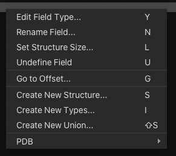
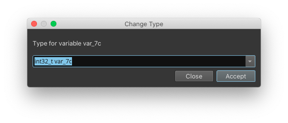

# Working with Types and Structures

This document is organized into three sections describing how to work with types in Binary Ninja. The first [section](#working-with-types) is how to interact with any type, regardless of its source.

The [second section](#type-library) explains how to work with the Type Library. This includes multiple sources of information from which Binary Ninja can automatically source for type information from and how you can add to them.

Finally, the [third section](#signature-library) explains how to work with the signature library. While the signature library technically does not directly inform types, it will help automatically match statically compiled functions which are then matched with the type libraries described in the previous section.

# Working With Types

There are two main ways to interact with types from within a binary view. The first is to use the [types view](#types-view), and the second is to take advantage of the [smart structures workflow](#smart-structures-workflow) or otherwise annotate types directly in a disassembly or IL view.

## Smart Structures Workflow

New to stable version 1.3.2015 is the "Smart Structures" feature. Rather than manually create a type in the type view and then apply it to disassembly, you can create structures directly from disassembly using the `s` hotkey.  Consider the following example (created using [taped](http://captf.com/2011/gits/taped) from the 2011 Ghost in the Shellcode CTF if you'd like to play along at home):

<div class="inline-slides">
    <ol id="taped">
        <li id="currentline">Assembly view of the start of <code>0x8048e20</code></li>
        <li>MLIL view of the same basic block</li>
        <li>MLIL view after selecting the return of <code>calloc</code> and pressing <code>s</code></li>
        <li>MLIL view after selecting the offset and pressing <code>s</code> to turn it into a member access</li>
        <li>MLIL view after selecting the remaining offsets and pressing <code>s</code> in turn</li>
        <li>Viewing the structure automatically created after this workflow</li>
        <li>Selecting the remaining bytes and turning them into an array using <code>1</code> to turn them all into uint_8 variables, and then <code>*</code> to turn them all into an array</li>
    </ol>

    <div id="light-slider-container">
        <ul id="light-slider">
            <li>
              
            </li>
            <li>
              
            </li>
            <li>
              
            </li>
            <li>
              
            </li>
            <li>
              
            </li>
            <li>
              
            </li>
            <li>
              
            </li>
        </ul>
    </div>
</div>

<script>
document.addEventListener("DOMContentLoaded", function(event) {
    let pause = 3000;
    let slider = $("#light-slider");
    let sliderContainer = $(slider.selector + "-container");
    window.slider = slider.lightSlider({
        item:1,
        loop: false,
        auto: false,
        speed: 200,
        pause: pause,
        slideMargin: 0,
        pauseOnHover: true,
        autoWidth:false,
        thumbMargin:0,
        onBeforeSlide: function (el) {
            Array.from($('ol#taped')[0].children).forEach(function(item, index, arr) {
              if (index == el.getCurrentSlideCount() - 1)
                item.id = "currentline";
              else
                item.id = "";
             });
        },
        onSliderLoad: function() {
            let sliderHeight = slider.height();
            slider.find('img').each(function() {
                $(this).parent().css("padding-top", (sliderHeight - this.naturalHeight)/2);
            });
            slider.removeClass('cS-hidden');
        },
        onAfterSlide: function(el) {
            if (el.getCurrentSlideCount() == el.getTotalSlideCount()) {
                setTimeout(() => {!el.is(':hover') && el.goToSlide(0)}, pause);
            }
        },
        onBeforeStart: function() {
            let width = 0;
            slider.find('img').each(function() {
                width = Math.max(width, this.naturalWidth);
            });
            sliderContainer.width(width);
        },
    });
    Array.from($('ol#taped')[0].children).forEach(function(item, index, arr) {
        item.addEventListener('click', function() { window.slider.goToSlide(index)});
    });
});
</script>

Note that the last step is entirely optional. Now that we've created a basic structure, and if we happen to do a bit of reverse engineering we learn that this is actually a linked list and that the structure /should/ look like:

```
struct Page
{
    int num;
    int count;
    Tape* tapes[8];
    struct Page* prev;
    struct Page* next;
}
```

Where tapes look like:
```
struct Tape
{
    int id;
    char* name;
    char text[256];
};
```

We can either update our automatically created structure by pressing `y` to change member types and `n` to change their names, or we can use the [types view](#types-view) to directly import the c code directly and then apply the types using `y`. That gives us a disassembly that looks like:


## Types View

To see all current types in a Binary View, use the types view. It can be accessed from the menu `View > Types`. Alternatively, you can access it with the `t` hotkey from most other views, or using `[cmd] p` to access the command-palette and typing "types". This is the most common interface for creating structures, unions and types using C-style syntax.

### Shortcuts and Attributes

From within the Types view, you can use the following hotkeys to create new types, structures, or unions. Alternatively, you can use the right-click menu to access these options and more.



* `s` - Create new structure
* `i` - Create new type
* `[shift] s` - Creating a new union

The shortcuts for editing existing elements are:

* `y` - Edit type / field 
* `n` - Rename type / field
* `l` - Set structure size
* `u` - undefine field.

Structs support the attribute `__packed` to indicate that there is no padding.

### Applying Structures and Types



Once you've created your structures, you can apply them to your disassembly. Simply select an appropriate token (variable or memory address), and press `y` to bring up the change type dialog. Note that for simple types you can also create them directly in the linear views or graph views. Additionally, you can apply types on both disassembly and all levels of IL. Any variables that are shared between the ILs will be updated through all of them as types are applied. 


### Examples 

```C
enum _flags
{
    F_X = 0x1,
    F_W = 0x2,
    F_R = 0x4
};
```

```C
struct Header __packed
{
    char *name;
    uint32_t version;
    void (* callback)();
    uint16_t size;
    enum _flags flags;
};
```

# Type Library


# Signature Library
